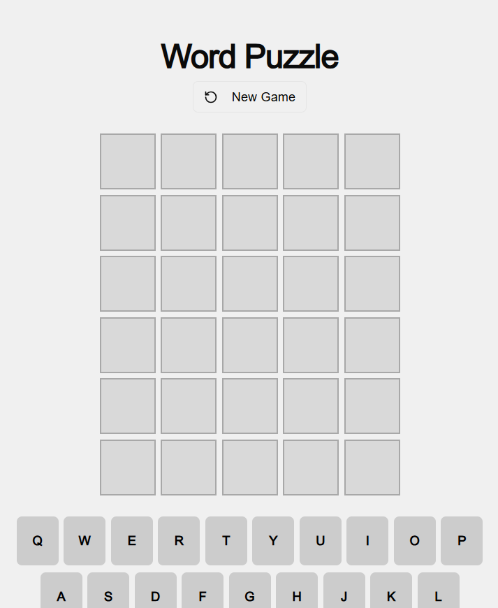

# 🟩 Wordle

A polished clone of the viral word game **Wordle**, built with **Next.js** and styled using **Tailwind CSS**.
Guess the hidden 5-letter word in 6 tries and test your vocabulary and logic skills!



## ✨ Features

* 🔠 5-letter word guessing game
* 🟩 Color-coded hints (green, yellow, gray)
* 🧠 Smart keyboard and tile animations
* 📱 Fully responsive design
* ♻️ Game reset on win or loss

## 🔧 Built With

* [Next.js](https://nextjs.org/) – React framework for fast performance and routing
* [Tailwind CSS](https://tailwindcss.com/) – Utility-first CSS for clean UI
* [JavaScript (ES6+)](https://developer.mozilla.org/en-US/docs/Web/JavaScript)
* [Firebase Studio](https://firebase.studio/)

## 🚀 Getting Started

### 1. Clone the repository

```bash
git clone https://github.com/Dhureen7/wordle-2
```

### 2. Install dependencies

```bash
npm install
```

### 3. Run the development server

```bash
npm run dev
```

Visit `http://localhost:3000` to see the app in action.

### 4. Build for production

```bash
npm run build
npm start
```

## 🖼️ Demo

In progress
